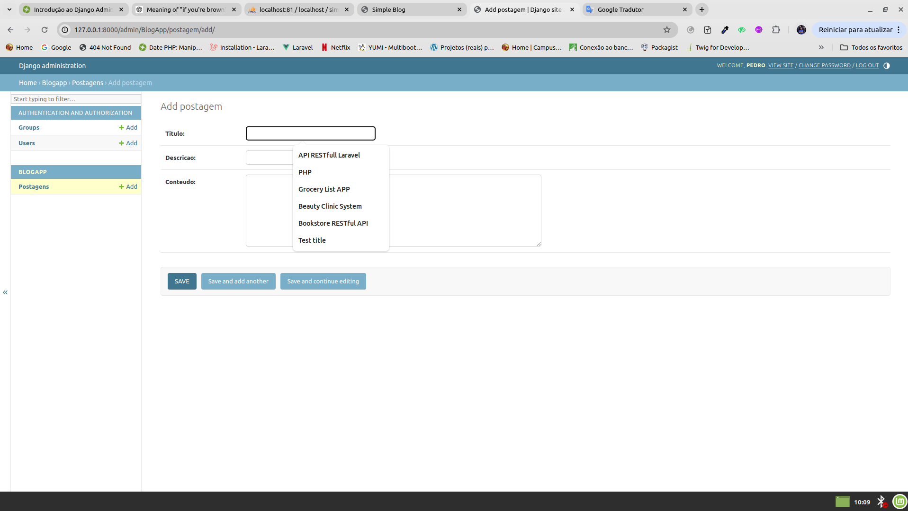
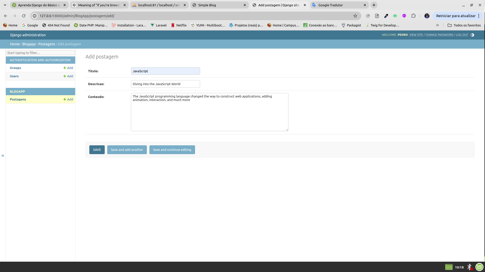
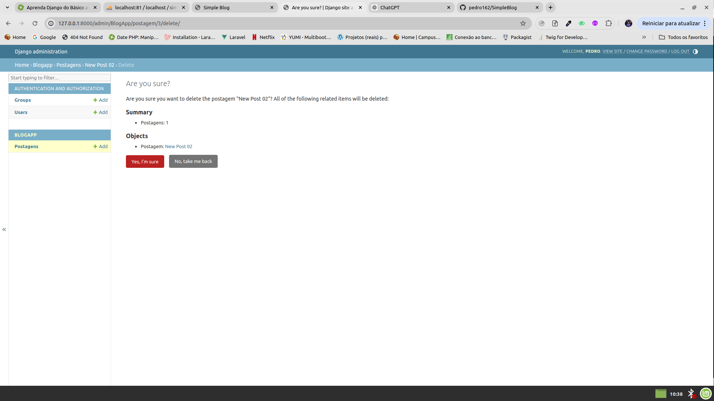
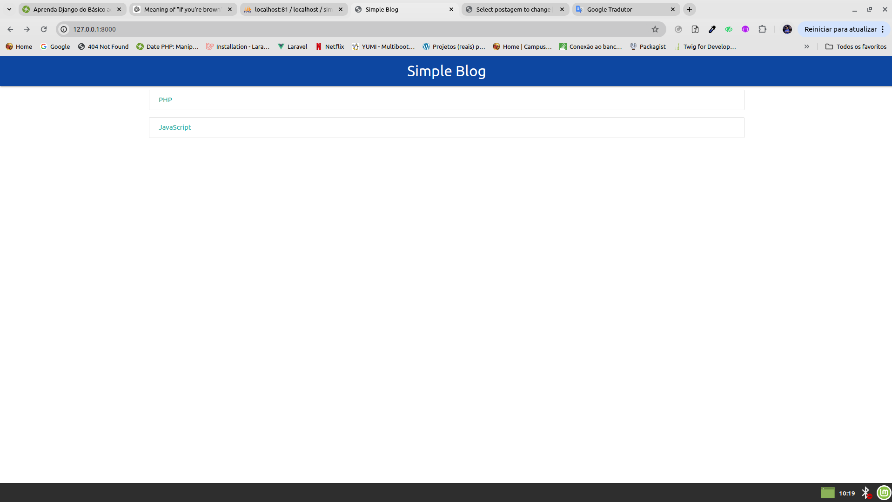

# SimpleBlog

SimpleBlog is a Django project that serves as a basic blogging platform. Administrators can manage blog posts through the Django Admin interface.

## Getting Started

Follow these steps to set up and run the project on your local machine.

### Prerequisites

Make sure you have the following installed:

- Python 3.x
- pip (Python package installer)
- Django 3.x

### Installation

1. **Clone the repository:**

   ```bash
   git clone https://github.com/pedro162/SimpleBlog.git
   cd SimpleBlog
   ```

2. **Create and activate a virtual environment:**

   ```bash
   python -m venv venv
   source venv/bin/activate  # On Windows use `venv\Scripts\activate`
   ```

3. **Install the required packages:**

   ```bash
   pip install -r requirements.txt
   ```

4. **Apply migrations:**

   ```bash
   python manage.py migrate
   ```

5. **Create a superuser:**

   ```bash
   python manage.py createsuperuser
   ```

6. **Run the development server:**

   ```bash
   python manage.py runserver
   ```

7. Open your browser and go to `http://127.0.0.1:8000/admin` to access the Django Admin interface. Use the superuser credentials you created to log in.

## Managing the Blog

### Creating a Post

1. Log in to the Django Admin interface.
2. Click on the "Posts" section.
3. Click the "Add post" button.
4. Fill in the necessary fields and click "Save".



### Updating a Post

1. In the "Posts" section, click on the post you want to update.
2. Make the necessary changes.
3. Click "Save".



### Deleting a Post

1. In the "Posts" section, select the post(s) you want to delete.
2. Choose "Delete selected posts" from the action dropdown menu.
3. Confirm the deletion.



### Viewing All Posts

1. Log in to the Django Admin interface.
2. Click on the "Posts" section to see a list of all blog posts.



## License

This project is licensed under the MIT License

## Acknowledgments

- This project was built using [Django](https://www.djangoproject.com/).
